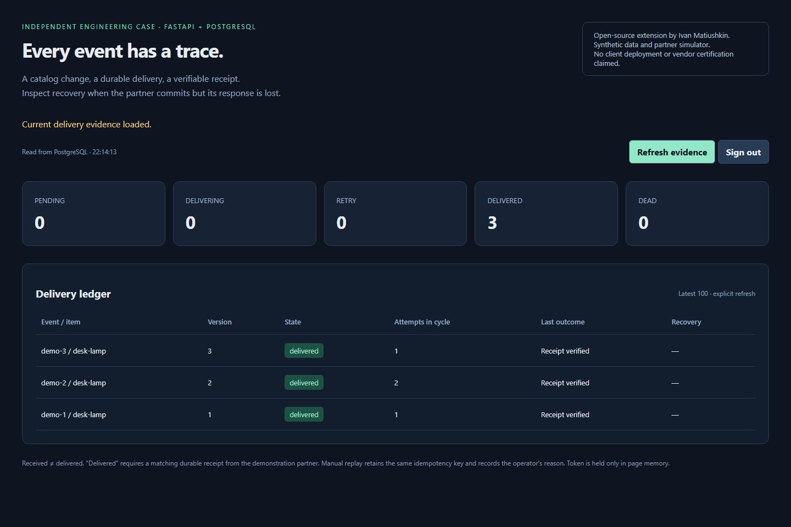

# Catalog webhook reliability — a FastAPI extension

[](https://github.com/Hadezu/fastapi-webhook-reliability/actions/workflows/webhook-proof.yml)
[](https://github.com/Hadezu/fastapi-webhook-reliability/actions/workflows/test-backend.yml)

**The partner accepted a change, but its HTTP response was lost. What happens on retry?**

This independent case adds signed catalog events, a PostgreSQL inbox/outbox and an operator recovery console to the **[Full Stack FastAPI Template](https://github.com/fastapi/full-stack-fastapi-template)**. It changes the existing application's actual `Item` records, then delivers a versioned projection to a synthetic partner over HTTP.

By **Ivan Matiushkin with Codex**. Upstream application by Sebastián Ramírez and contributors, MIT. Independent/test work, not paid client history, an upstream-endorsed patch, a Shopify integration or a production reliability claim.

## Inspect



[Watch the recorded local recovery demonstration](docs/images/recovery-demo.webm)

- [Case study](CASE-STUDY.md) · [Architecture and guarantees](docs/ARCHITECTURE.md)
- [Verification](docs/VERIFICATION.md) · [Demo and recovery runbook](docs/DEMO.md)
- [Our changes against upstream](https://github.com/Hadezu/fastapi-webhook-reliability/compare/1762adac607a1b29cfc4da129557780beea71616...main)

| Situation | Observable result |
| --- | --- |
| Concurrent identical events | One inbox, one Item effect, one outbox |
| Same event ID, different content | Conflict; no partial change |
| Older entity version arrives late | Recorded as stale; newer Item preserved |
| Invalid signature/timestamp | Rejected before application writes |
| Process dies before commit | Item, inbox and outbox roll back together |
| Partner commits, response lost | Retry retains key; partner applies once |
| Worker dies after partner commit | Lease reclaimed; receipt resolves retry |
| Old worker finishes after replacement | Token fences its database completion |
| Retry budget exhausted | Dead delivery; reasoned operator replay with same key |

## Run locally

Requires Docker Compose v2 and Python 3 for configuration/sender scripts. No cloud account, paid API, production credentials or SMTP service.

```sh
python proof/configure.py
docker compose --env-file .env.proof -f compose.proof.yml up -d --build
python proof/send.py sample-1
python proof/send.py sample-1
```

Open **http://127.0.0.1:8090/proof**. Use `FIRST_SUPERUSER` and `FIRST_SUPERUSER_PASSWORD` from generated **private** `.env.proof`. Existing application: `/`, API docs: `/docs`. The upstream Items view shows imported records. Both sends correspond to one delivery.

First startup builds React and migrates PostgreSQL; wait for `/api/v1/utils/health-check/` before sending. Only the API port is published, on loopback. Worker/receiver stay internal. Ordinary restarts preserve the database volume. `docker compose --env-file .env.proof -f compose.proof.yml down` stops the demo; adding `-v` deliberately removes its data.

## Validate without Docker

Python **3.14**, uv **0.12.23**, Bun **1.3.12**, disposable PostgreSQL 18 database named `webhook_proof`:

```sh
uv sync --locked --package app --group dev
bun install --frozen-lockfile
bun run --filter frontend build
```

Generate `.env.proof`, load its variables into your process environment, and set `DATABASE_URL` to the disposable PostgreSQL database. Tests require `PROOF_TEST_ALLOW_RESET=1` and truncate demonstration tables. **Never target useful data.**

```sh
cd backend
uv run alembic upgrade head
uv run pytest tests/api/routes/test_items.py tests/crud -q
uv run pytest ../proof_tests -q
```

The extension tests use real PostgreSQL and a separate HTTP receiver process. Isolated HTTP-classification tests use a declared transport double. CI also checks pristine upstream tests, migration roundtrip, frontend build and actual Compose delivery. A separate backend gate runs the full upstream backend suite plus extension tests and requires at least 90% coverage across `app`, with HTML/XML evidence. See [verification scope and results](docs/VERIFICATION.md).

## Review map

- `backend/app/webhooks/protocol.py`: strict payload and HMAC protocol.
- `service.py`: transaction spanning inbox, upstream Item, mapping and outbox.
- `worker.py`: leases, HTTP delivery, retries, fencing and audit.
- `routes.py`: ingress, operator status, controlled replay.
- `console.html`: operator UI; access token held only in memory.
- `backend/proof_receiver.py`: explicitly synthetic partner and fault controls.
- `proof_tests/`: concurrency, separate-process crashes and recovery.

## Boundaries

One configured source/owner; absolute versioned snapshots, not stock deltas or payments. The partner must implement the documented durable receipt contract. A generic vendor API does not inherit these guarantees. Demo processes share a PostgreSQL instance/credential for convenience; this is not tenant isolation. No SLA, load benchmark, security certification or client deployment is claimed.

A suitable paid slice is one webhook endpoint, duplicate-processing fix, outbox recovery path or integration test pack, after inspecting the actual API contract.

Safe line: **“I extended an existing FastAPI application with a PostgreSQL-backed webhook flow and tested concurrent duplicates, lost responses and worker crash recovery against a synthetic HTTP partner.”**

[Portfolio](https://work.matiushkin.com/en) · [GitHub](https://github.com/Hadezu) · ivan@matiushkin.com

Independent contractor · Poland / remote collaboration<br>
Integrations, automation and internal systems for businesses

## Attribution

Upstream baseline `1762adac607a1b29cfc4da129557780beea71616`; [original README](docs/UPSTREAM-README.md). Original MIT license retained. New extension: MIT, Copyright 2026 Ivan Matiushkin. Upstream deployment workflows are inert reference text in `docs/upstream-workflows/`; this proof does not deploy. Other upstream security/dependency configuration is preserved.
