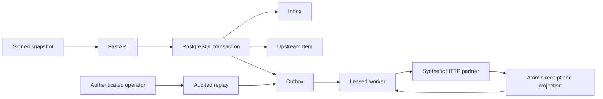

# Protocol and guarantees



## Ingress contract

`POST /api/v1/catalog-sync/events`, JSON up to 64 KiB:

```json
{"event_id":"sample-1","external_id":"lamp-1","version":1,"title":"Desk lamp","description":"Synthetic sample"}
```

Bounded ASCII IDs, positive 32-bit version, strict types, no extra/duplicate JSON fields. Headers: `X-Webhook-Timestamp` (Unix seconds), `X-Webhook-Signature` (hex HMAC-SHA256 over `timestamp + '.' + raw_body`). Tolerance ±300 seconds. Retried events can be re-signed; database deduplication persists beyond that window. No key-rotation overlap implemented.

Configuration fixes the source, owner and destination. Payloads cannot select a user or URL. Operator endpoints reuse active-superuser auth; normal users retain Item visibility rules. Source-managed Items reject manual API update/delete with 409. Retiring the dedicated owner needs a lifecycle procedure; foreign keys prevent silent deletion of managed records.

## Local atomicity

Transaction advisory locks serialize event identity then entity identity. Hash collisions only add serialization; unique keys and explicit identity comparisons remain authoritative. Local lock/statement timeouts bound waits. Inbox, Item, mapping and outbox commit together.

Same ID with equivalent normalized JSON returns the prior receipt. Changed content under that ID returns 409. Lower version is recorded stale; equal current version with changed content returns 409. Equal version/content under a new ID is unchanged. Higher version applies the full snapshot. Old stale payloads are not compared to every historical version.

202 means **local commit**, not partner delivery. Storage outage returns 503. A sender that loses the 202 retries the same event ID.

## Delivery

Claims use `FOR UPDATE SKIP LOCKED`, increment attempts, set a random lease token and commit before HTTP. Default lease 30 seconds; per-phase HTTP timeout 3 seconds; five claims per retry cycle. Partner deduplication covers overlapping sends after lease expiry; token fences local completion.

Outbound signature covers `timestamp + '.' + delivery_uuid + '.' + raw_body`. UUID is `Idempotency-Key`. HTTPS required except local demo hosts; redirects/environment proxies disabled. Response bodies are not buffered. 2xx counts as delivered only with matching `X-Receipt-Key`.

408/429/5xx and transport uncertainty retry with bounded jitter. Numeric Retry-After is honored up to 300 seconds on 429/503 (HTTP-date not implemented). Other statuses become dead. Missing receipt retries within budget. Final crashed lease becomes dead on expiry. Operator replay resets cycle budget but retains UUID; claims, outcomes and replay reasons remain in the audit.

Receiver persists key/hash and changes its versioned projection atomically. Same key/different content is 409. Monotonic versions tolerate outbound reordering. No reverse webhook exists, so this example does not introduce a circular sync loop.

## Boundary

**At-least-once transport; single partner effect per retained key under the tested contract.** No general exactly-once guarantee. A provider without durable idempotency or lookup needs reconciliation/manual review before retrying ambiguous writes.

Receiver is a simulator. Separate processes, HTTP and transactions are real; its separate schema shares the local PostgreSQL instance/credential. This does not demonstrate tenant isolation. `RECEIVER_DATABASE_URL` can optionally point it at a separately prepared database.

Before real deployment: provider sandbox/contract tests, TLS ingress, rate limits/backpressure, key rotation, DB roles, backups/restore, alert delivery, graceful shutdown, retention, load/soak testing, migration under load and environment threat review. Deleting retained receipt/inbox records can weaken replay guarantees; no cleanup policy is silently assumed. Never put customer/credential data in demo payloads. Loopback Compose is not a production deployment guide.
